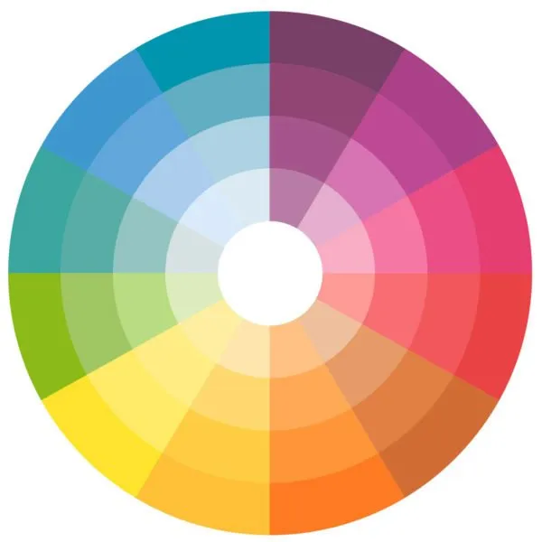
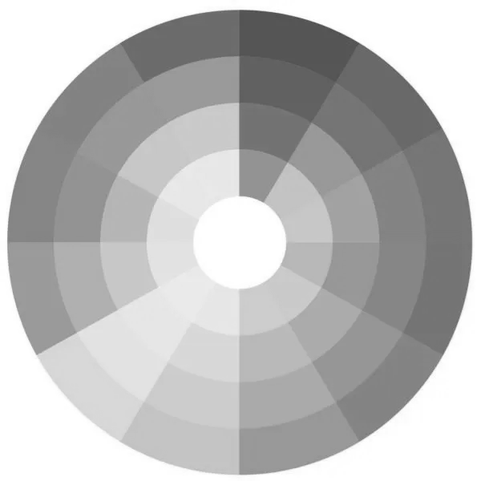
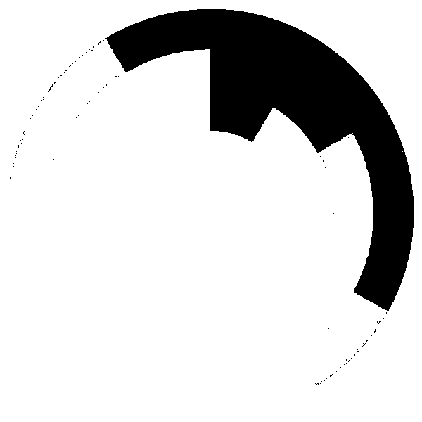

# Desafio: Binarização de Imagem com Python 🖼️

Este projeto faz parte do módulo de Visão Computacional da DIO e tem como objetivo realizar a **conversão de uma imagem colorida** em:

- Escala de cinza (grayscale)
- Imagem binarizada (preto e branco)

---

## 📷 Exemplo de Saída

A imagem original utilizada foi a famosa **Lena**:

| Original | Escala de Cinza | Binarizada |
|----------|------------------|-------------|
|  |  |  |
---